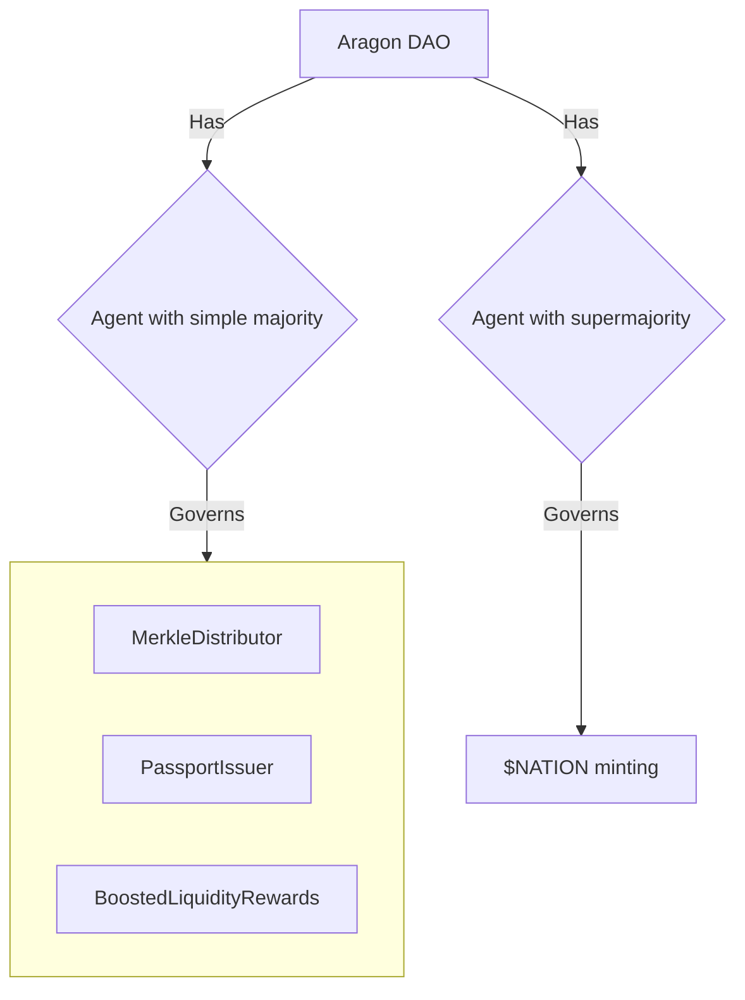

# DAO

The Nation3 DAO is an [Aragon DAO](https://aragon.org) with:

- Two [Agent app instances](https://aragon.org/agent): One — called just Agent — is meant to hold funds and control non-sensitive actions, and the other one — called Critical Agent — is meant to control extraordinary or sensitive actions, such as minting new $NATION or making significant changes to the DAO itself.
- Two Voting app instances: One per Agent app. The first one is governed by $veNATION holders with simple majority voting, and the other with supermajority (66%) and a minimum quorum (20%). The latter is the one used to decide on sensitive actions. More on its parameters can be read on [Nation3's governance process](https://github.com/nation3/gov#proposalswith-critical-impact).

Here's a breakdown with the permission structure:

## What's currently governed by the DAO

- Via the normal Agent instance:

  - Its treasury, consisting of most of $NATION's initial supply
  - The [`MerkleDistributor`](https://etherscan.io/address/0xcab2B7614351649870e4DCC3490Ab692bf3beD60) smart contract used for the tweetdrop
  - The [`PassportIssuer`](https://etherscan.io/address/0x279c0b6bfCBBA977eaF4ad1B2FFe3C208aa068aC) smart contract that will be used to mint and burn passports
  - The [`BoostedLiquidityRewards`](https://etherscan.io/address/0x4f1e79793fd5f5805b285c3f29379b8056a4476b) smart contract used to distribute liquidity rewards

- Via the Agent (veNATION supermajority) instance:
  - The $NATION token (the DAO can decide on the minting schedule, or cap the supply)
  - Its own voting parameters and other key DAO parameters

## Who is the initial proposal committee

The proposal committee can submit proposals to Snapshot and to the Aragon DAO.

- [Luis Cuende](https://twitter.com/licuende): Nation3 core contributor, previously founder of Aragon.
- [Carlos Juarez](https://twitter.com/0xPaella): Nation3 core contributor, previously founder of Guesser (acquired by Gemini).
- [Uxio Piñeiro](https://twitter.com/0xgallego): Nation3 core contributor, smart contract developer.
- [Anastasiya Belyaeva](https://twitter.com/anastasiya_vc): Nation3 core contributor, previously founder of Fabric Ventures.
